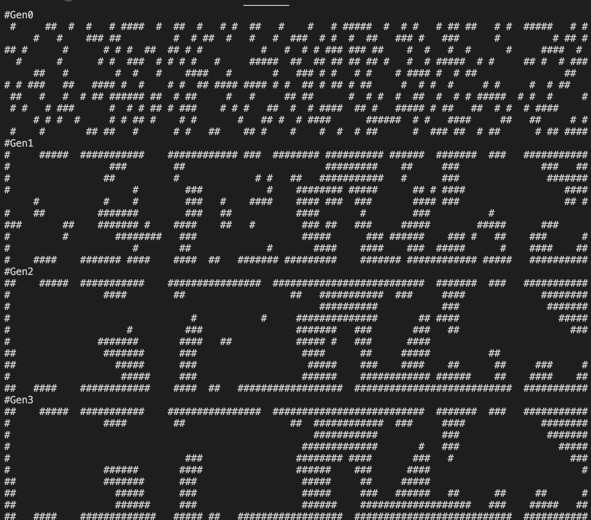

# Project_SBPG
* Seed-Based Procedural Generations

> 시드값을 기준으로 절차적 생성 알고리즘을 연구하는 프로젝트입니다.  
---
## 목차

[0. 왜 시드베이스 절차적 생성 인가?](##0.-왜-시드베이스-절차적-생성-인가?)

## 0. 왜 시드베이스 절차적 생성 인가?

### 0.1. 절차적 생성

<table width="100%" text-align="center" >
    <tr>
        <td width="50%">
            
        </td>
        <td width="50%">
            
        </td>
    </tr>
    <tr>
        <td>
            ▲ 디아블로3
        </td>
        <td>
            ▲ 문명 5
        </td>
    </tr>
</table>

위 게임들은 방대한 양의 컨텐츠로 오랜 시간 유저를 묶는다는 점 때문에 소위 악마의 게임이라고 불러진다. 

유저들에게 지속적이면서도 새로운 경험을 하게 도와주는 비결은 **절차적 생성**에 있다고 한다.

**절차적 생성**을 이용하여 적은 리소스로 많은 양의 컨텐츠를 생성 할 수 있다.

* 디아블로
 
 디아블로의 경우 균열 시스템을 예로 들 수 있는데
 
 스토리 진행에 사용된 맵 리소스를 재활용 하여 **절차적 생성**과정을 거쳐 새로운 맵을 생성한다.
 
 지루할 수 있는 템 파밍 과정인데, 매번 새로운 맵으로 새로운 경험을 주는것으로 지루함을 상쇄한다.
 
* 문명 5
 
 문명5의 지도는 **절차적 생성**을 거쳐 무작위맵이 생성된다.
 
 하지만 지형이 무작위로 생성되었기 때문에 모든 플레이어가 균일한 시작조건을 가지고있지 않기 때문에 밸런스적 문제가 존재하는데,
 
 그래서 여러 플레이어가 경쟁하는 구도인 멀티플레이에서는 특히 절차적 생성의 특징을 사용하기 어렵다. 
 
 특히문명5에선 구석세종, 대보초스페인등 특이한 조건을 가진 플레이어가 압도적으로 강한 위치를 가지는 경우도 존재한다.

### 0.2. 그럼 왜 시드베이스인가

앞서 말했다싶이 절차적 생성의 단점중 하나는 **밸런스** 에 있다.

시드 베이스 절차적 생성을 하는 게임 

지금부터 함께 절차적생성에 사용되는 알고리즘들을 알아보자.

## 1. 각종 알고리즘들

### 1.1. 셀룰러 오토마타 알고리즘 (동굴 생성)

셀룰러 오토마타 알고리즘을 이용하면 자연스러운 동굴의 형태를 만들 수 있다.

무작위로 0 과 1을 배치 한 후, 셀룰러 오토마타 4-5룰을 4회정도 적용하면 자연스러운 동굴의 형태를 만들 수 있다.

이 상태로 보면 이해하기가 힘드므로 간단하게 React로 프론트 제작을 해보겠다.
