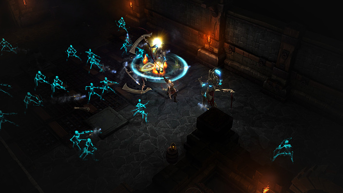
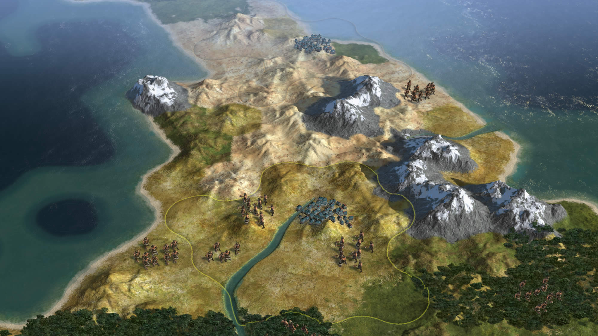

# Project_SBPG
* Seed-Based Procedural Generations

> 시드값을 기준으로 절차적 생성 알고리즘을 연구하는 프로젝트입니다.  
---

## 0. 왜 시드베이스 절차적 생성 인가?

### 0.1. 절차적 생성

디아블로3             |  문명5
:-------------------------:|:-------------------------:
  |  

방대한 양의 컨텐츠로 오랜 시간 유저를 묶는다는 점 때문에 악마의 게임이라는 악명을 가진 게임들이 있습니다.

이 게임들이 방대한 양의 컨텐츠를 가질 수 있게 만든 비결은 `절차적 생성`에 있습니다.

### 0.2. 그럼 왜 시드베이스인가

## 1. 시드값 베이스의 셀룰러 오토마타 알고리즘 구하기
